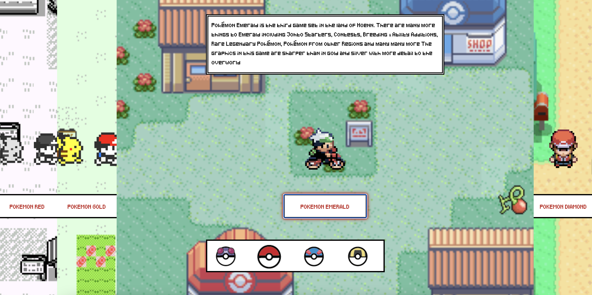
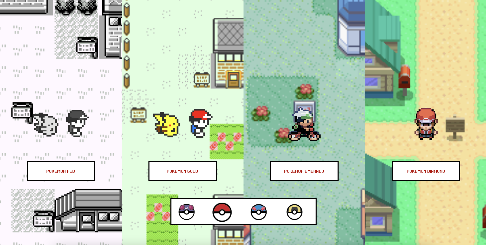

# Procesverslag
Markdown is een simpele manier om HTML te schrijven.  
Markdown cheat cheet: [Hulp bij het schrijven van Markdown](https://github.com/adam-p/markdown-here/wiki/Markdown-Cheatsheet).

Nb. De standaardstructuur en de spartaanse opmaak van de README.md zijn helemaal prima. Het gaat om de inhoud van je procesverslag. Besteedt de tijd voor pracht en praal aan je website.

Nb. Door *open* toe te voegen aan een *details* element kun je deze standaard open zetten. Fijn om dat steeds voor de relevante stuk(ken) te doen.

## Jij

### Ontwerper:
Tamar Langenburg

#### Je startniveau:
Mijn startniveau is blauw. Ik heb voor blauw gekozen omdat mijn codeer vaardigheden helemaal weg gezakt zijn, en ik uit ervaring weet dat ik vaak zal vast lopen. 

# Je plan

  
Dit is de eerste schets van mijn ontwerp 

  ### De eerste versie/schets:
  Voor mijn eerste schets heb ik als idee om de verschillende stijlen van de pokemon games naast elkaar te laten staan en wanneer je meer informatie wil hebben over een spel, je op een list item kan klikken en er dan een tekstvak komt te staan. Ik wil hier een loop animatie voor de poppetjes gebruiken. 

  

  ### De tweede versie/schets:
  Na mijn idee besproken te hebben, wilde ik nog een paar extra dingen toevoegen. zoals de optie om je cursor naar verschillende pokeballen te veranderen. En items waar je op kan klikken en je daar ook nog informatie over te zien krijgt.

  

  ### Je ambitie: 
  Aan deze technieken/punten wil ik werken:
  - Ik wil op de website de achtergronden laten bewegen
  - De curser moet in een pokebal kunnen veranderen
  - er moet een keyframes animatie in
  - De website moet responsive zijn
 

## Voortgang/Feedback 1

  
Mijn bevindingen + wijzigingen. Feedback van Zara

  #### Bevinding 1:
  Het concept is leuk, maar ik moet nog goed bedenken wat ik als content erbij ga vertellen en hoe ik de poppetjes laat lopen.

  #### oplossing:
  Ik ga bij elke list item een beweegende afbeeling op de achtergrond doen. En een GIF animatie voor de poppetjes gebruiken.

  #### Bevinding 2:
  De tekst had ik nog niet en de afbeeldingen. Die moet ik nog verzamelen.

  #### oplossing:
  Ik heb een moment genomen om alle afbeeldingen te vinden en in het mapje images te doen.

  #### Bevinding 3:
  Tijdens het zoeken heb ik goed moeten kijken naar de kwaliteit en naar de grote van de afbeeldingen, vooral omdat er genoeg ruimte moet zijn voor het poppetje om te lopen.

## Voortgang/Feedback 2

  
Mijn bevindingen + wijzigingen. Feedback van Ellen

  
  ### Bevinding 1:
  De afbeelingen passen goed bij mijn thema, maar kunnen nog niet bewegen. Ik heb nu alleen dat de poppetjes Gif het wel doet.

  #### oplossing:
  Ik heb de tip gekregen om background positie te gebruiken om de achtergrond afbeeldingen te laten bewegen over het scherm, en te positioneren.

  ### Bevinding 2:
  De Website is nog niet responsive, en ik moet nog veel doen aan de code. zoals custom properties etc.

  #### oplossing:
  Ik ga de responsiveness aanpassen van de achtergronden en de poppetjes image in de li overlay hidden zetten, zodat ze niet meer overlappen. 

  ### Bevinding 3:
  Ook moet ik nog een default lettertype vinden, want die deed het niet op een andere laptop.

## Voortgang/Feedback 3

  
Mijn bevindingen + wijzigingen feedback van Marleen

  
  ### Bevinding 1:
  De button van de Pokemon Gold is niet goed klikbaar. en de animaite van de hover state duurt te lang waardoor de je de button klikt en het te lang duurt tot hij in de active state gaat. 

  #### oplossing:
  Ik heb de transition van de hover korter gemaakt en dat doet het nu goed. Ook heb ik het klikbaarheid van de pokemon Gold button opgelost door de button iets lager te zetten.

  ### Bevinding 2:
  Wanneer iemand de link op github klikt, ziet hij/zij nog niet het goede lettertype. 

  #### oplossing:
  Dit heb ik opgelost door de font via font-face kunnen toevoegen in mijn code en nu kan je ook op andere laptops de goede font zien.

  #### bevinding 3:
  Marleen had laten zien hoe je een fav icon kan gebruiken waardoor je een icoontje voor je website link kan doen. Dit wil ik ook nog toevoegen aan mijn ontwerp.

  #### oplossing: 
  Ik heb op gezocht hoe je een favicoon in je html doet. En nu heb ik een pokebal als icoon.

  #### bevinding 4:
  Ik had nog geen easter egg toegevoegd.

  #### oplossing:
  Ik heb in elke list een berry gedaan. wanneer iemand er overheen hovert komt het te voorschijn en speelt een schud animatie. In de pokemon spellen heb je ook ontzichtbare items liggen die je alleen kan vinden door overal te kijken.

## Reflectie

  
Mijn eindresultaat & persoonlijke ontwikkeling

  ### Je uitkomst - karakteristiek screenshot(s):
  
  

  ### Dit ging goed/Heb ik geleerd: 
  Ik heb geleerd hoe de basics van coderen werken. Ik heb dingen geleerd zoals keyframe animaties, layout met grid en flex en hoe ik elementen responsive kan maken. Ook heb ik geleerd hoe ik op verschillende manieren font kan toevoegen. En ik ben in het algemeen blij dat ik al mijn ambities heb gehaald.

  

  ### Dit was lastig/Is niet gelukt:
  Wat mij niet gelukt was doordat ik bij kleine dingen vast liep, zoals het responsive maken van de list items. heb ik niet meer interactie en/of animaties kunnen toevoegen. En het is mij niet gelukt om precies het ontwerp na te maken van mijn schets. De basis dingen heb ik wel na kunnen maken.

  

## Bronnenlijst

1. Layout horizontaal hover https://codepen.io/shooft/pen/XWZKdgM
2. Layout tekst verdwijnen https://codepen.io/christinemoore/pen/ExvqjL
3. stijlen van de buttons en interactief maken https://codepen.io/shooft/pen/gOvgbga?editors=1100
4. States op de button https://codepen.io/shooft/pen/gOvgbga?editors=1100
5. Font service via @font-face https://dlo.mijnhva.nl/content/enforced/324125-FDMCI-6000C06_21-DMCI-CMD-2122/VIDii%2021-22%20-%20VID%202%20-%20Fonts.pdf?_&d2lSessionVal=MlhGXkYzvBqZwHRleQwxxzPw8
6. Schud animatie voor de berries https://blog.hubspot.com/website/css-animation-examples
7. Achtergrond laten bewegen met background position https://developer.mozilla.org/en-US/docs/Web/CSS/background-position
8. icoon voor in de browser https://www.w3schools.com/html/html_favicon.asp

